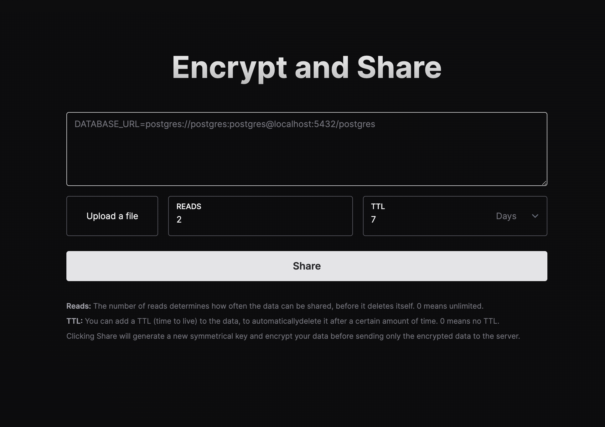

    <h1 align="center">EnvShare</h1>
    <h5>Share Environment Variables Securely</h5>

  <a href="https://vishal11u.dev">envshare</a>

 

EnvShare is a simple tool to share environment variables securely. It uses
**AES-GCM** to encrypt your data before sending it to the server. The encryption
key never leaves your browser.

## Features

- **Shareable Links:** Share your environment variables securely by sending a
  link
- **End-to-End Encryption:** AES-GCM encryption is used to encrypt your data
  before sending it to the server
- **Limit number of reads:** Limit the number of times a link can be read
- **Auto Expire:** Automatically expire links and delete data after a certain
  time

 

## Built with

- [Next.js](https://nextjs.org)
- [tailwindcss](https://tailwindcss.com)
- Deployed on [Vercel](https://vercel.com?utm_source=envshare)
- Data stored on [Upstash](https://upstash.com?utm_source=envshare)

## Configuration

### Environment Variables

`ENABLE_VERCEL_ANALYTICS` Any truthy value will enable Vercel Analytics. This is turned off by default

## Contributing

This repository uses `pnpm` to manage dependencies. Install it using
`npm install -g pnpm`

Please run `pnpm fmt` before committing to format the code.
